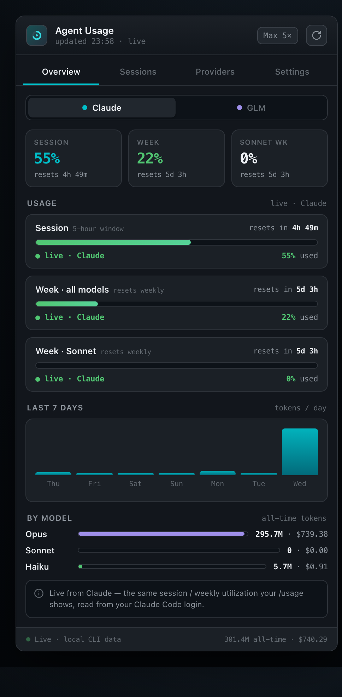
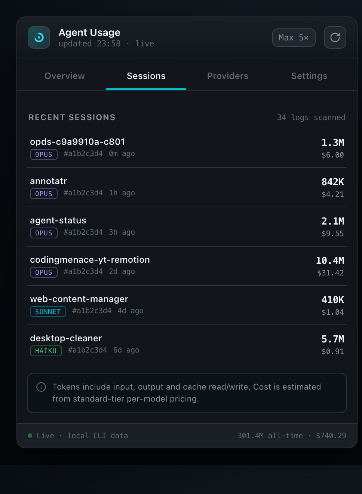
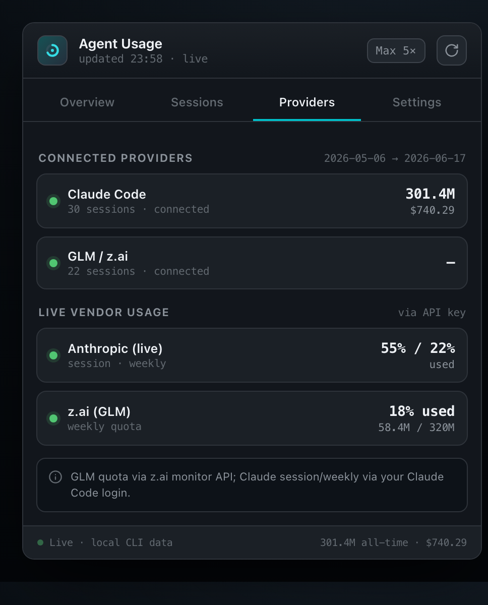
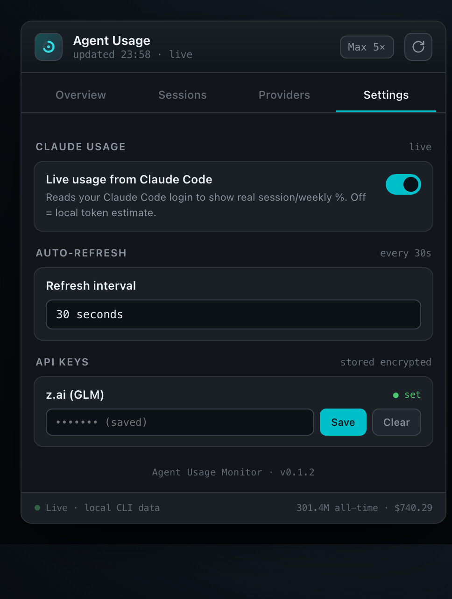

<div align="center">

# 📊 Agent Usage Monitor

### A lightweight macOS **menubar widget** that tracks your Claude Code & GLM CLI usage in real time.

Session / weekly / Opus limits · token spend · cost estimates · per-session history — all read from local logs, refreshed on a timer, living quietly in your menu bar.

<br/>


<br/>



</div>

---

## ✨ Features

- **What's left, at a glance.** Mirrors Claude's `/usage` view — three meters for **Session (5h)**, **Week · all models**, and **Week · Opus**, each with real usage and a live reset countdown.
- **Real token data.** Exact per-request token counts parsed straight from Claude Code's session logs — input, output, and cache read/write.
- **Cost estimates** per model (Opus / Sonnet / Haiku) from standard-tier pricing.
- **7-day spark chart** + all-time model breakdown + recent-session history.
- **Live vendor data (optional).** Add a GLM Coding Plan or Anthropic admin API key — stored **encrypted, machine-bound** — for real GLM 5h/weekly quota and org-level Anthropic cost.
- **Always current.** A Rust timer re-scans and pushes fresh data to the UI — **auto-refresh interval is configurable in Settings (default 30s)**, applied live without a restart. No frozen snapshots.
- **Stays out of the way.** Menubar-only (`LSUIElement`), click-to-toggle dropdown, single-instance, launch-at-login.
- **Self-updating.** Signed auto-updates via the Tauri updater — an in-app "Update & restart" banner appears when a newer build ships.

---

## 🖼️ Screens

<table>
  <tr>
    <td align="center" width="50%">
      <br/>
      <b>Overview</b> — limits, reset timers, week chart, model split
    </td>
    <td align="center" width="50%">
      <br/>
      <b>Sessions</b> — recent sessions with project, model, tokens, cost
    </td>
  </tr>
  <tr>
    <td align="center" width="50%">
      <br/>
      <b>Providers</b> — connection status + live vendor usage
    </td>
    <td align="center" width="50%">
      <br/>
      <b>Settings</b> — plan tier + encrypted API keys
    </td>
  </tr>
</table>

---

## 🏗️ Architecture

A **thin React frontend** that only renders, and a **rich Rust backend** that does all the work.

```
┌──────────────────────────────┐        ┌─────────────────────────────────────┐
│  React frontend (src/)        │        │  Rust backend (src-tauri/src/)        │
│                               │        │                                       │
│  useUsage / useTauriCommand   │◀──────▶│  commands/   invoke handlers          │
│  Meter · WeekChart · Settings │ invoke │  scanner/    log aggregation          │
│                               │ + event│  vendors/    z.ai + Anthropic clients │
│  renders the snapshot         │◀──────▶│  encryption/ AES-256-GCM key vault    │
│                               │ usage- │  settings/ · state/ · storage/        │
│                               │ updated│  tray.rs     menubar dropdown         │
└──────────────────────────────┘        └─────────────────────────────────────┘
                                            ▲ timer (cfg) ▲ on-demand refresh
                                            │            │
                            ~/.claude/projects/**/*.jsonl · ~/.zai/zai-mcp-*.log
```

The backend scans logs (off-thread via `spawn_blocking`), optionally fetches live vendor data, merges one `UsageSnapshot`, and emits `usage-updated` to the UI.

---

## 📡 Data sources — what's real vs. estimated

| Metric | Source | Real? |
| --- | --- | --- |
| Claude token usage (session/week/model) | `~/.claude/projects/**/*.jsonl` | ✅ exact |
| Claude cost | derived from per-model pricing | ≈ estimated |
| Reset countdowns | computed from log timestamps | ✅ real |
| **"% left" ceilings** | editable plan tier (Pro / Max 5× / Max 20×) | ≈ estimated* |
| GLM token/cost (local) | `~/.zai/*.log` — lifecycle only | ❌ shown as `—` |
| GLM 5h/weekly quota (with key) | z.ai monitor API (`/api/monitor/usage/quota/limit`) | ✅ real |
| Anthropic cost (with admin key) | Anthropic Admin Cost API | ✅ real (org-level) |

\* The Pro/Max subscription "weekly % left" has **no public API**, so ceilings are estimates you set by picking your plan. The Anthropic admin key reports **org-level** cost, not the subscription quota.

---

## 🚀 Quick start

```bash
npm install
npm run tauri dev      # develop
npm run tauri build    # bundle an unsigned .app + .dmg (local testing)
```

> **Heads-up:** if your shell sets `NODE_ENV=production`, install with
> `NODE_ENV=development npm install --include=dev` so the dev toolchain is included.

### 📦 Shipping a signed build

For a `.dmg` that installs cleanly on **any** Mac (no Gatekeeper warnings), it
must be **signed with a Developer ID cert and notarized by Apple**:

```bash
cp .env.example .env   # fill in your signing identity + notarization creds
./scripts/release-mac.sh
```

See **[docs/RELEASE.md](docs/RELEASE.md)** for the full runbook (certificates,
notarization credentials, verification, universal builds, troubleshooting).

---

## ⚙️ Configuration

- **Auto-refresh interval** — choose 10s / 15s / 30s / 1m / 2m / 5m in Settings (default **30s**); takes effect on the next cycle.
- **Plan tier** — pick Pro / Max 5× / Max 20× from the header dropdown; it sets the limit ceilings and persists.
- **API keys** (Settings tab) — optional z.ai and Anthropic admin (`sk-ant-admin…`) keys for live vendor data.
- **z.ai endpoint** — editable; confirm it against your account's billing API.

### 🔒 Security

API keys are encrypted with **AES-256-GCM** using an **Argon2id**-derived key whose password is this machine's UID — so a `settings.json` copied elsewhere can't be decrypted. Keys never leave Rust in plaintext and are never exposed to the frontend (which only sees `…KeySet` booleans).

---

## 📁 Project structure

```
agent-status/
├── src/                      # React frontend (thin)
│   ├── hooks/                # useTauriCommand, useUsage
│   ├── components/           # Meter, WeekChart, VendorCard, Settings
│   └── styles/app.css
└── src-tauri/                # Rust backend (rich)
    └── src/
        ├── commands/         # invoke handlers (collect = scan + vendor)
        ├── scanner/          # log → UsageSnapshot aggregation
        ├── vendors/          # z.ai + Anthropic API clients
        ├── encryption/       # at-rest key vault
        ├── settings/ state/ storage/
        └── tray.rs           # menubar icon + dropdown
```

---

## 🧪 Tests

```bash
cd src-tauri && cargo test --all     # 12 tests: scanner, encryption, vendor parsers
```

CI runs the suite on macOS / Windows / Ubuntu (`.github/workflows/unit-tests.yml`).

---

## 📝 Notes / TODO

- **Icon** lives at `src-tauri/icons/icon.svg` → `icon.png`; re-run `npx @tauri-apps/cli icon src-tauri/icons/icon.png` after editing to regenerate every size.
- **Bundle identifier** is `com.dennisrongo.agentstatus` — change in `src-tauri/tauri.conf.json` if distributing under a different org.
- **Signing, notarization & auto-updates** for distribution — see [docs/RELEASE.md](docs/RELEASE.md).
- Live vendor endpoints are best-effort and unverified offline — confirm against your accounts on first run.
